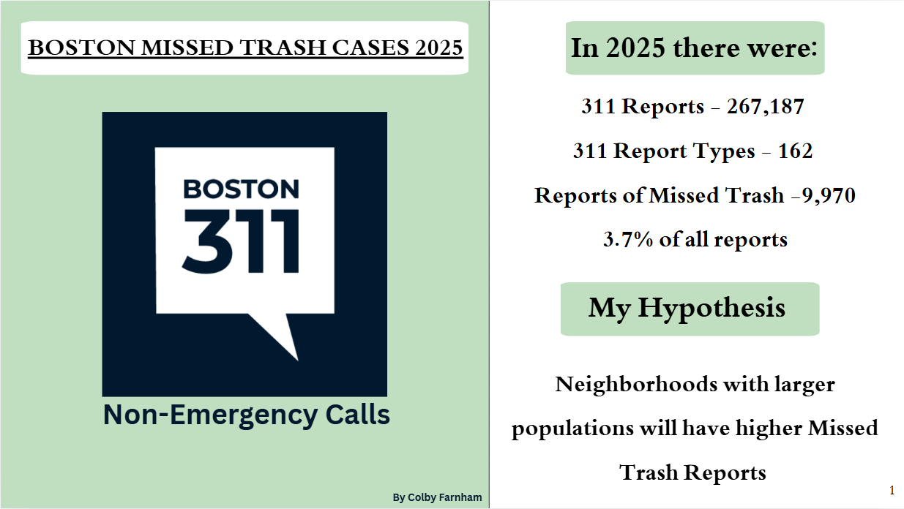

# 📊 Boston 311 Missed Trash Reports (2025)

## Objective
Analyze Boston 311 service requests to identify which neighborhoods have the highest **Missed Trash/Recycling/Yard Waste/Bulk Item** report rates in 2025, including normalization **per 1,000 residents**.

---

## Data
- **311 Service Requests (2025)**: `trash_raw`
- **Neighborhood Populations**: `boston_populations`

> Note: Neighborhood labels were matched between datasets via the `neighborhood` field.

---

## Tools Used
- PostgreSQL (CTEs, JOINs, Window Functions)
- GitHub for version control

---

## Key Questions
1. How many total 311 reports were submitted in 2025?
2. How many were related to missed trash?
3. Which neighborhoods have the most missed trash cases?
4. Which neighborhoods have the highest **missed trash rate per 1,000 residents**?
5. Does **neighborhood population** corelate to the **missed trash rate**?

---

## 📊 Visualizations



---

## Core SQL (per-capita ranking)
```sql
WITH per_neighborhood AS (
  SELECT
    t.neighborhood,
    COUNT(*) AS missed_cases_2025,
    p.total_population AS town_population
  FROM trash_raw t
  LEFT JOIN boston_populations p
    ON t.neighborhood = p.neighborhood
  WHERE t.case_types = 'Missed Trash/Recycling/Yard Waste/Bulk Item'
  GROUP BY t.neighborhood, p.total_population
),
with_totals AS (
  SELECT
    *,
    SUM(town_population) OVER () AS total_population_all
  FROM per_neighborhood
),
percentages AS (
  SELECT
    neighborhood,
    town_population,
    missed_cases_2025,
    ROUND(1000.0 * missed_cases_2025 / NULLIF(town_population, 0), 2) AS missed_per_1000_people,
    ROUND(100.0 * missed_cases_2025 / NULLIF(SUM(missed_cases_2025) OVER (), 0), 4) AS pct_of_total_cases
  FROM with_totals
)
SELECT *
FROM percentages
ORDER BY missed_per_1000_people DESC;
